# Writing Style & Documentation Maintenance

## Writing Style Guide

### General Principles
1. **Be concise**: Remove unnecessary words
2. **Use active voice**: "The system sends" not "The email is sent"
3. **Be specific**: "Increases performance by 50%" not "Better performance"
4. **Use examples**: Show, don't just tell
5. **Structure hierarchically**: Use headings and lists
6. **Keep consistent**: Same terms for same concepts

### Tone
- Technical but accessible
- Professional but friendly
- Instructive not prescriptive
- Assume intelligence not knowledge

### Formatting
- **Bold** for UI elements, filenames, important terms
- `Code` for commands, code snippets, variables
- *Italics* for emphasis (sparingly)
- Lists for steps, options, requirements
- Tables for comparisons

---

## Changelog Format (Keep a Changelog)

```markdown
# Changelog

All notable changes to this project will be documented in this file.

The format is based on [Keep a Changelog](https://keepachangelog.com/en/1.0.0/),
and this project adheres to [Semantic Versioning](https://semver.org/spec/v2.0.0.html).

## [Unreleased]

### Added
- New payment provider integration (Stripe)
- Export functionality for user data (GDPR compliance)

### Changed
- Updated user dashboard with new analytics widgets
- Improved error messages for API validation

### Fixed
- Fixed race condition in order processing
- Corrected timezone handling in date filters

## [2.1.0] - 2024-01-15

### Added
- Multi-factor authentication support
- Webhook event subscriptions

### Changed
- **BREAKING**: Authentication now requires OAuth 2.0

### Deprecated
- `/api/v1/users` endpoint (use `/api/v2/users` instead)

### Removed
- Legacy XML API support

### Security
- Patched XSS vulnerability in comment system (CVE-2024-1234)

[Unreleased]: https://github.com/user/repo/compare/v2.1.0...HEAD
[2.1.0]: https://github.com/user/repo/compare/v2.0.0...v2.1.0
```

### Changelog Categories
- **Added** - New features
- **Changed** - Changes to existing functionality
- **Deprecated** - Features to be removed
- **Removed** - Features removed
- **Fixed** - Bug fixes
- **Security** - Vulnerability patches

---

## Diagrams with Mermaid

### System Architecture


### Sequence Diagram


### Flowchart

```mermaid
flowchart TD
    Start([User submits form]) --> Validate{Valid input?}
    Validate -->|No| Error[Show error message]
    Validate -->|Yes| Check{User exists?}
    Check -->|Yes| Update[Update user]
    Check -->|No| Create[Create user]
    Update --> Success([Return success])
    Create --> Success
    Error --> End([End])
    Success --> End
```


---

## Documentation Maintenance

### Review Checklist
- [ ] Information is accurate and up-to-date
- [ ] Code examples work and are tested
- [ ] Links are not broken
- [ ] Screenshots are current
- [ ] Version numbers are correct
- [ ] Formatting is consistent
- [ ] Grammar and spelling are correct
- [ ] Examples cover common use cases

### Versioning Strategy
- Version docs with code (git tags)
- Maintain docs for current and previous major version
- Archive old versions but keep accessible
- Use version selector in docs site

---

## Resources

- Keep a Changelog: https://keepachangelog.com/
- Semantic Versioning: https://semver.org/
- OpenAPI Specification: https://swagger.io/specification/
- TSDoc: https://tsdoc.org/
- Google Developer Documentation Style Guide: https://developers.google.com/style
- Write the Docs: https://www.writethedocs.org/
